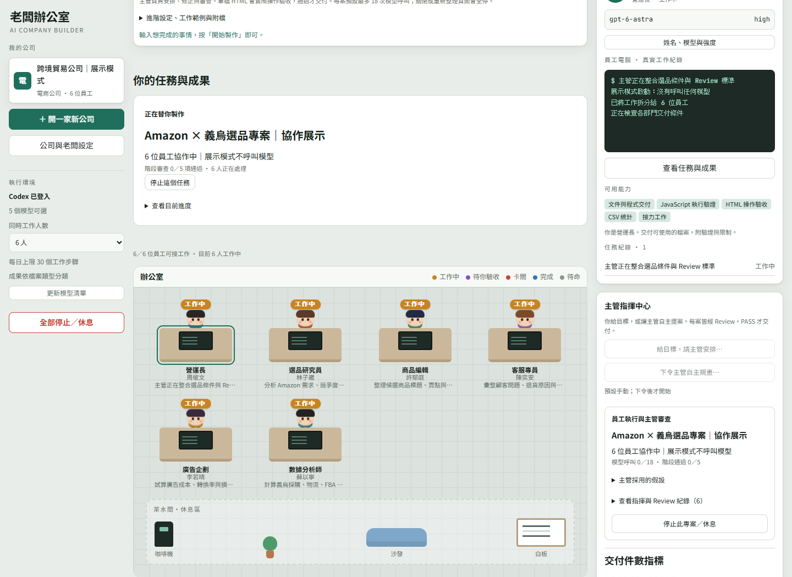

# AI Boss Office｜AI 老闆辦公室

[](https://github.com/ertwer2001/ai-boss-office/actions/workflows/ci.yml)
[](LICENSE)

把一個目標交給 AI 主管，由主管拆解工作、安排員工、審查成果，通過後交付可下載的真實檔案。這是 Windows 本機優先的 Codex 多角色工作台；老闆、公司與員工都能改名，模型與推理強度會從目前登入的 Codex 動態讀取。



## 主要能力

- **從目標到成果**：主管負責規畫、分工、請示、Review、退回修正與最終交付。
- **兩種主管模式**：你輸入明確目標，或明確授權主管依公司類型自主規畫專案。預設維持手動模式。
- **真實 AI 員工**：每位員工可設定姓名、職位、Codex 模型與推理強度；新案件保存當下設定快照。
- **品質門檻**：員工成果需通過階段 Review；HTML 作品會依事先訂定的操作條件進行瀏覽器驗收，再由主管判定 PASS／FAIL。
- **可控用量**：每案有模型呼叫上限，可停止單一案件、單一公司或全部工作。關閉或重新整理辦公室分頁會觸發全部停止。
- **真實檔案交付**：文件、程式與資料依類型、公司、任務和版本分資料夾保存，並記錄 SHA-256。
- **本機文件解析**：可選裝 Docling 2.127.0，在本機解析 PDF／DOCX 後交給主管使用。

## 系統需求

- Windows 10 或 Windows 11
- Node.js 24 以上
- 已登入的 Codex Desktop 或可用的 Codex CLI
- npm（隨 Node.js 安裝）

模型推論使用你目前登入的 Codex 帳號與額度。專案不需要在程式碼或 `.env` 存放 OpenAI API key。

## 安裝與啟動

```powershell
git clone https://github.com/ertwer2001/ai-boss-office.git
Set-Location ai-boss-office
npm ci
npm run build
```

完成後雙擊 `啟動老闆辦公室.vbs`，或執行：

```powershell
npm start
```

瀏覽器開啟 <http://127.0.0.1:4317>。啟動器會隱藏命令視窗、避免重複啟動服務，並優先尋找 Codex Desktop 內附的 Node.js 24；也可用 `BOSS_OFFICE_NODE` 指定 `node.exe`。

## 使用方式

1. 開啟左側「公司與老闆設定」，修改公司、老闆或員工名稱。
2. 點員工座位設定模型、推理強度與專業角色。選單資料來自 Codex 的即時 `model/list`。
3. 輸入目標後按「開始製作」。主管會安排必要人員並控制工作相依順序。
4. 在「你的任務與成果」查看白話摘要，按「開啟成果」使用完成品。
5. 遇到問題時員工先請示主管；只有付費、憑證、對外操作、難以回復的改動或核心目標變更才升級給老闆。

### 自動規畫

預設不會無目標自動派工。只有你按下「下令主管自主規畫」並完成授權後，主管才會依公司類型規畫後續專案。可設定每日案件數、間隔時間與每案模型呼叫上限。

### 停止控制

| 操作 | 效果 |
|---|---|
| 每案「停止／休息」 | 停止該專案的主管、員工與後續接力 |
| 「本公司停止／休息」 | 停止該公司所有未完成案件並關閉自主規畫 |
| 「全部停止／休息」 | 停止所有公司的執行與排隊案件 |
| 關閉或重新整理辦公室頁面 | 觸發全公司停止；持續連線失聯約 15 秒也會停止 |

停止會終止由本 App 啟動的本機模型程序與子程序。已送出的雲端請求可能已產生用量，已使用的額度不會退還。

## 資料與隱私

執行資料不會納入 Git：

| 路徑 | 內容 |
|---|---|
| `data/` | 公司狀態、任務工作區、附件與服務日誌 |
| `../員工成果/` | 依文件、程式、資料、圖片與其他類型分類的正式成果 |
| `../runtime/` | 選裝的 Docling 虛擬環境與模型 |
| `docs/verification/` | 本機測試與驗收暫存證據 |

只有 `data/catalogs/agency/profiles.json` 是程式需要的公開角色目錄，會納入版本控制。HTML 成果預覽使用隔離頁面，禁止網路、母頁資料與表單外送。

## 環境變數

| 變數 | 用途 | 預設值 |
|---|---|---|
| `BOSS_CODEX_BIN` | 指定 Codex CLI 執行檔 | 自動搜尋 Codex Desktop／PATH |
| `BOSS_OFFICE_NODE` | 指定 Node.js 24 執行檔 | Codex 內附 Node 或 PATH |
| `BOSS_PORT` | 本機服務連接埠 | `4317` |
| `BOSS_DATA_DIR` | 公司狀態與工作區 | `./data` |
| `BOSS_OUTPUT_DIR` | 正式成果根目錄 | `../員工成果` |
| `BOSS_DISABLE_INFERENCE` | 設為 `1` 時停用模型推論，供隔離測試 | 未設定 |
| `BOSS_OFFICE_PYTHON` | Docling 安裝使用的 Python | Codex 內附 Python 或 PATH |
| `BOSS_SHOWCASE_DIR` | 展示截圖的額外輸出目錄 | `docs/screenshots` |

## 選裝 Docling

Docling 只負責本機文件解析，本身不會消耗 Codex 模型強度；解析結果真正交給 AI 員工時才會使用 Codex 額度。安裝會下載 Python 套件與文件模型，需要較多磁碟空間。

```powershell
.\tools\docling\install.ps1
```

若自動找不到 Python 3.12 以上：

```powershell
.\tools\docling\install.ps1 -Python 'C:\Path\To\python.exe'
```

## 開發與驗證

投顧研究公司可選裝 [TradingAgents 研究引擎](tools/tradingagents/README.md)。研究使用獨立 API／本機模型；Codex 員工負責整理與主管 Review。整案 PASS 後，成果頁會直接顯示上游實際回傳的 K 線、成交量、資料截止日、來源和限制；原始 `tradingagents-evidence.json` 仍可下載並以 SHA-256 校驗。圖表由 [TradingView Lightweight Charts™](https://tradingview.github.io/lightweight-charts/) 呈現，不提供行情資料。設定完成前研究入口保持停用，關頁與各級停止沿用辦公室控制。上游固定來源及 Apache-2.0 授權位於 `tools/tradingagents/`。

```powershell
npm test
npm run build
npm run verify
```

`npm run verify` 會用隔離資料啟動本機服務，確認即使尚未安裝或登入 Codex 也能開啟辦公室；不呼叫模型。名稱包含 `live` 的驗證腳本可能會使用 Codex 額度，因此不在 CI 或預設測試內。GitHub Actions 會在 Windows 與 Node.js 24 上執行單元測試、正式建置與零模型 HTTP 驗證。

架構與資料流見 [docs/ARCHITECTURE.md](docs/ARCHITECTURE.md)。第三方來源及授權見 [docs/THIRD_PARTY_NOTICES.md](docs/THIRD_PARTY_NOTICES.md)。

## 已知限制

- 本專案目前只監聽 `127.0.0.1`，沒有提供公開網路部署或手機遠端存取。
- AI 員工共用目前登入的 Codex 能力，不是各自獨立的帳號或虛擬機。
- JavaScript 行為測試在 QuickJS 沙箱執行；沒有 Node.js、DOM、網路或主機檔案權限。
- 對外寄信、發布、採購、上架、金流、物流與交易尚未自動接入；相關任務只會產生待人工執行或驗收的成果。
- 模型 Review 是有紀錄的品質判斷，不能保證外部事實、法規、財務或商業成效正確。

## 授權

本專案以 [MIT License](LICENSE) 開源。Agency Agents 衍生角色保留其原始 MIT 授權與來源標示。
