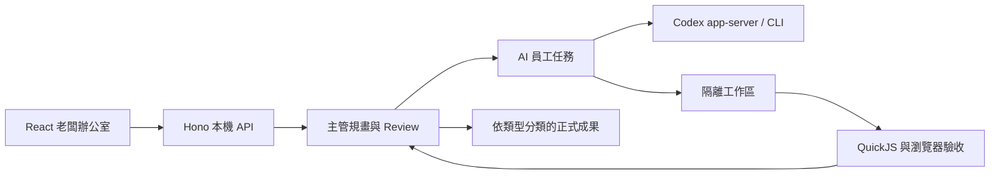

# 架構

## 執行流程

## 元件

- `src/`：React、Zustand、公司／員工領域模型及操作介面。
- `server/`：Hono API、Codex 連線、派工、主管專案、程序停止、文件解析、工作區與成果發布。
- `scripts/`：啟動器、隔離驗證與明確選用的實際模型驗證。
- `tools/docling/`：選裝的 PDF／DOCX 本機解析工具。
- `data/catalogs/agency/`：由 Agency Agents 改寫並保留來源標示的角色模板。

## 狀態與成果

服務預設把狀態寫到 `data/`，正式成果寫到專案上一層的 `員工成果/`。兩者都不納入 Git。工作檔先留在任務工作區，只有通過必要驗收和主管最終 Review 的版本才發布到正式成果資料夾。

## 控制邊界

- 服務只監聽 `127.0.0.1`。
- 會改變狀態的 API 要求本機操作標頭並限制 Origin。
- App 只終止自己啟動且已記錄的程序樹。
- HTML 驗收使用隔離頁面；JavaScript 行為測試使用 QuickJS。
- 模型清單與可用推理強度在執行時向 Codex 讀取。
- 自主規畫必須由老闆明確授權，並受每日案件數、間隔與呼叫上限約束。
